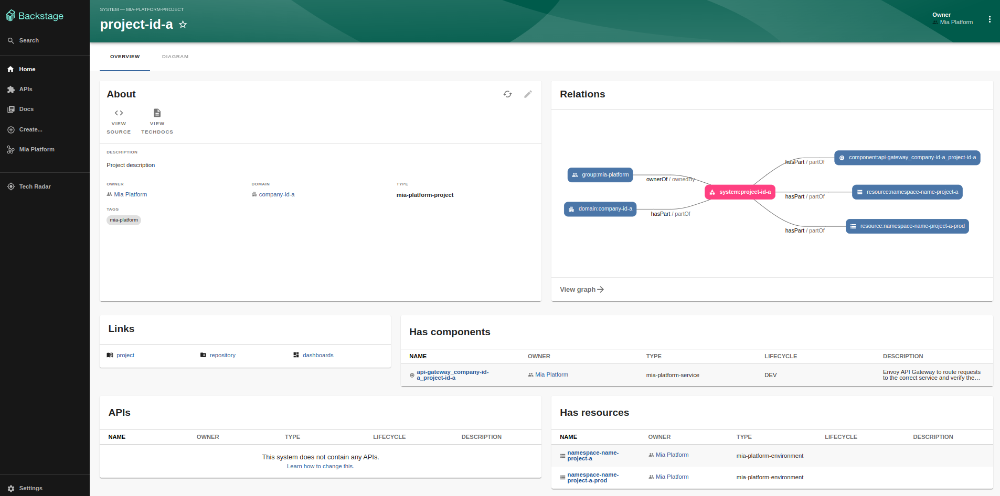

# Mia-Platform Backstage Plugin

Mia-Platform plugin elevates your workflow that seamlessly integrates your Mia-Platform components into Backstage. It keeps your information synchronized effortlessly and gains insights into your company's domains, projects, deployment environments, and repository links, all while exploring their interrelations.

## Mia Platform Configuration

It is necessary to follow these steps on your Mia-Platform console for the plugin to work properly:

1. Create a service account in the `Access Management` section:
    - select between the two authentication methods: `JWT` or `Client Secret Basic`;
    - select the Company Role field as `Reporter` which is the minimum permission.

2. Once you have created the service account you can use the credentials to authenticate to the console and retrieve the Company and Project information.

3. The projects on your Mia-Platform console must use the Enhanced Workflow in order for the Backstage plugin to display all data correctly.

4. The revisions(branches) of your projects must have the same name as the label of the environments you are using.

## Requirements

For the plugin to work, the following packages must be installed and configured in the backstage application: 
 - [`@mia-platform/backstage-plugin-frontend`](https://github.com/mia-platform/backstage-plugin/blob/main/packages/plugin-frontend/README.md)
 - [`@mia-platform/backstage-plugin-backend`](https://github.com/mia-platform/backstage-plugin/blob/main/packages/plugin-backend/README.md)

 ## How it works

This plugin lets you access the companies you have on your Mia-Platform console with all its resources.

In the homepage of the plugin it is possibile to sync each project to get the latest updates on the project or to sync all the resources you have on your Mia-Platform Console.
For each project it is possible to be redirected through the links to the project on the console and to the repository on the git provider of your project.

Each company, project and its components are automatically added to your backstage catalog with all its relations.

By clicking on the specific entity, you can access its details and view its components, subcomponents, links, systems, and resources.

An example of a component detail page:

An example of a system/project detail page: 

